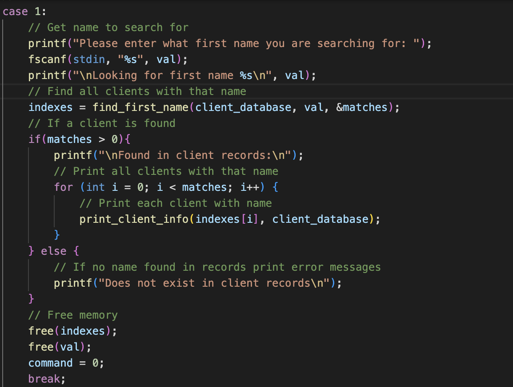

# Bug Squashing
Dear Junior Developer,

Thank you for your work on the program. After reading over and evaluating your program, I have constructed this report to show what errors and what enhancements could be made to the program. The program you made is about finding and sorting people within a list of client data and returning information about the client (name, phone number and email address). Your original implementation does not work properly, and the list below is all the changes I have made. Some changes are to make the program compile and work for its intended purpose, and others are to change the efficiency and formatting of the code. All changes are under the assumption that the input is correct and valid.

If you want to build and run my version of the program, follow the instructions below:

To build main.c: `gcc -o main main.c`
To run main with test_data file: `./main test_data.txt`

## Program Changes: 

**Lack of comments:** Comments are need for other developers reading your code, but also for you. If you were to come back to this program in a few months, you might struggle to understand what the program is doing. I also had to read over your code many times to understand what it was doing. I added comments to your program to make it easier to understand what is happening at each stage of the program.

**Including libraries:** You accidentally included the `stdio.h` library twice so I deleted one of its mentions.

**Fixing sort methods:** The original implementation of your sort methods did not work correctly and more importantly, they were not needed to find a client. I have fixed the implementation of the sort methods and given an extra option in the menu for the user to print out all clients so they can see all clients in a sorted order. I used `strcmp` to compare the two clients by the user chosen identifier (first name for example) next to each other in the client database. If the return value of `strcmp` is greater than 0, then you swapped the two clients around by calling a another function called swap_clients.

*New sort and swap_clients functions:*

Your previous implementation of the sort method doesn't work because the `>` is used for integer comparsion and can't be applied for comparing strings. You also needed to fix how you swap clients around. 

`ss[i] = ss[j];
ss[j] = ss[i];`

This needs to have a temporary variable to store the value of client_database i. Otherwise, you lose the value of client_database i when you assign client_database j to client_database i (which has been set to client_database j).

**EmailAddress spelt EmialAddress:** This error did not affect the program at all, but if another developer were to join the project later on, they might struggle to call the variable. 

**Function names:** Your previous functions name are known to you but to others, it is very confusing to read what the function's purpose is. I changed the function names to be more descriptive of what the function is doing and to follow C naming conventions.

*Here is a list of the function name changes:*
- `ffn` to `find_first_name`
- `fln` to `find_last_name`
- `fem` to `find_email`
- `fph` to `find_phone`
- `sfn` to `sort_first_name`
- `sln` to `sort_last_name`
- `sem` to `sort_email`
- `sph` to `sort_phone`

**Struct name:** I changed the name of the struct from **S** to **clients** to make it more clear what the struct is holding. As well as that I changed the name of the struct variables to be more clear. **ss** is now **client_database** and **s** is now **client**. This makes it easier to a person reading the code to understand that client_database holds the entire sturct while client holds the data of a single client.

**C naming conventions:** I changed many of your variable names to follow the C naming conventions. This is not a major issue but it is good practice to follow the conventions to make your code more readable to others. For example **firstName** now becomes **first_name**.

**Making phone a char:** I decided to change phone inside our client_database struct to be a char*. This is because phone numbers can contain letters and symbols depending on their formatting i.e. +64 027... or 027-641-2390. This is not a major issue but could be good here as we do not always know how it is going to be formatted from client to client. Though this means we are using slightly more memory to store the phone number, it is not a major issue as we are not storing a huge database of clients currently.

*Here are the changes to the struct for reference: Red is old, Green is new*

**Printing user information:** The program felt a bit useless because it would only say it found a user. To give the program more functionality I decided to print all data related to the client i.e. name (first and last) phone number, and email address. I decided to have the command to print user information in the separate function called `print_user_info`. This function takes in the index of the client in the client_database struct and prints the information of the client. Each switch case will call on this function to print out the client information. Or print all clients when the user calls the command to print all clients.

**Prompting user with headings:** Your implementation has no headings to tell the user what to input. This is ok for you and I running the program, but potential users need to know what the program is expecting them to input. I added headings to make it easier for the user to know what to input at each stage of the program.

Here is the new program output:

**Reconfiguring find_phone and find_email:** There were two major issues with your find functions. The use of the == operator compares the memory address of the two string arguments, not their contents. Instead, you should use strcmp to compare the strings. Strcmp returns 0 if the strings match so we can just write an if statement to check that condition.

The second mistake was that you were not assigning i back to 0 before the loop.

Here is what I change your find_phone and find_phone functions to:

*Note obviously find_phone is searching* `client[i]->phone` *instead of* `client[i]->email_address`

**Reconfiguring find_first_name and find_last_name:** The above change of the find functions only work when there is a single client with a unique identifier like email or phone. However, since names are not unique, the implementation will only display the first client in the struct with the matching name. If there are multiple clients with the same name, only the data of the first client in the list will be returned.

So I had to change how the find_first_name and find_last_name work. Email addresses and phone numbers are typically unique to a person, so these functions did not need changing.

Now the functions return the indexes (row) where the client has the name we are searching for. So when we call find_first_name in our switch case in main, we loop for the number of matches found in client data, and print out the users by accessing the indexes these users are found in the client data list.

**Adding Quit Option and Program End:** I added a quit option to the program so the user can exit the program if they no longer wish to search for a client. I also didn't like how the program would end after just one search, so I added a while loop to allow the user to search for multiple clients without having to restart the program again and again. I did this by adding a simple loop that will repeat until the user enters 10 to quit the program.

**Reading the file:** fOpen should always be finished with a fClose. I also added a check to see if the file is empty (null). If the file is empty, the program will exit with an error message. 

Next the loop `for(i = 0; i < 50; i++){}` will only read the first 50 lines of the file. If the file has more than 50 lines, the program will not read the rest of the file. I changed the loop to read the file until the end of the file is reached.

I added the line `while (fscanf(f, "%s %s %s %s", firstName, lastName, phone, emailAddress) != EOF) {` to read the file until the end of the file is reached. Here fscanf is used to read the file and store the data in the variables first_name, last_name, phone and email_address. The loop will continue to read the file until the end of the file (EOF) is reached.

**Memory allocation:** Because the memory allocation for s was done outside of the loop reading in the file a new memory block is allocated for each line read from the file. When the memory allocation was done outside the loop, the same memory block was reused for each line, resulting in the loss of previous data as it was only storing data from the last line read.

At the start of the main function, I declare a number of chars for a clients first_name, last_name, phone, and email_address. After scanning the contents of the file and storing the chars respectively to their input, I use the `strdup` to allocate memory for the struct and copy the contents of the char to the struct. `strdup` uses malloc to allocate memory to the struct and then copies the char contents within the file and copies it to the client.

*Here is my new implementation of how we read the file, allocate memory and copy contents of file to struct:*

**Free memory:** It is good practice to free memory after an item is no longer needed. Not doing so can cause memory leaks. I added multiple free statement to free the memory allocated to the different items after the program has finished using them.

**While loop:** Your use of `break` after finding the client does not exit the while loop. It only exits the switch case. I added a command = 0; to exit the while loop after finding the client. You also missed a break; before the default case.

**Double up on switch case:** You have two switch cases saying they are looking for email address. I reconfigured the switch cases as follows:

- Case 1: Find client by first name
- Case 2: Find client by last name
- Case 3: Find client by email address
- Case 4: Find client by phone number
- Case 5: Sort clients by first name
- Case 6: Sort clients by last name
- Case 7: Sort clients by email address
- Case 8: Sort clients by phone number
- Case 9: Print all clients
- Case 10: Quit program
- Default: Handles invalid input

**gets() and printf:**
For better usability, I added in printf statements where we ask the user for the input required to progress. Your program without these statements makes it unclear what the user is supposed to do if it is their first time using this program. After this statement, I use a fscan to read the user input. I would recommend not using `gets()` in your future programs. gets() has been removed from C's standard library because it is unsafe. It does not check the length of the input and can cause a buffer overflow.

**Handling inputs:** I have added in a check when you can the command input from the user to check if the input is a integer or not. If not, the program will print an relevent error message and prompt the user with the same menu as before until a valid input is entered. Below is a code snippet of how implemented this.

**Remember brackets:** A lot of your code does not include brackets or got the wrong brackets. Please include the proper use of brackets in future programs to make them compile and run properly. Also helps you read your code better.

Thank you very much for your original attempt at the problem. Please reach out if you have any questions about the changes I made to the program. I hope you can learn from the changes I made and apply them to your future projects.

Cheers
Luke Piper 3648114