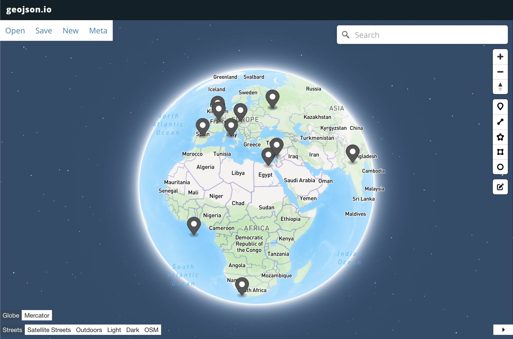

# COSC326 Etude 7 - Where In The World of CS

## Etude task
The objective of this task is to create a program that can convert a sequence of coordinates (in Standard, DMS, DM format) into a GeoJSON file and visually display the resulting file for the user. The goal is to try and be as inclusive as possible for user inputs, however if the input is impossible to interpret, the program must write to the console `Unable to process: followed by the invalid line`.

## Running the program
Compile: `javac -cp lib/java-json.jar src/WhereInTheWorld.java`
Run: `java -cp lib/java-json.jar:src WhereInTheWorld`

---

I have utilized the geojson.io website to visualise the given coordinates. After receiving the input from the user, the program will convert the inputs into a JSON file and then open the geojson.io website to display the points on the map. The JSON file will appear on the right side of the website.

The goal of the program is to be as inclusive as possible for all inputs given by the user. Here is a list of accepted cases the user can enter:

- *Standard form.*
- *Standard form except for the number of decimal points given differs from 6.*
- *Standard form except the comma is missing.*
- *Standard form, except the numbers are non-negative and followed by N or S (for
latitude) and E or W (for longitude), possibly in the wrong order.*
- *“Degrees, minutes, seconds” form with or without decimal places on the seconds,
and with or without the standard markers for degrees, minutes and seconds.*
- *Degrees and decimal minutes form.*

---

For a quicker and more user friendly design, I allowed the user to open up a filechooser where they can select any txt file to read the inputs from.

## Understanding The Program
My implementation consists of three major parts; parsing user input, storing input in json file, and finally opening geojson.io. The parsing of user inputs was the most difficult due to the amount of vairations and inclusvity I tried to provide the user.

## Methods
- **main(String[] args)**
The main method is responsible for reading the lines of input from the user, using a scanner. Each line is passed into the parseInput(String input) method; once returned, if the input is valid, it is added to the JSON object. Once the scanner is closed, the main will call writeJSONToFile and openGeoJSON to create the JSON file and open it visually on geojson.io.
- **parseInput(String input)**
The *parseInput* method validates whether or not the input provided can be converted into JSON. If the input is valid, the method returns a double array with the latitude and longitude values. Otherwise, the method prints "Unable to process" and returns null. The method matches the input with regular expression patterns for standard form, DMS, and DM coordinate styles. If the input matches any of these patterns, the method converts the input into a latitude and longitude value using the corresponding methods.
    - **ConvertStandardForm(Matcher matcher)**
        *Example:* `-45.8655 S, 170.515 E Otago University`
    - **ConvertDMS(Matcher matcher)**
        *Example:* `51° 30' 12.5" N, 0° 7' 39.1" W (London, UK)`
    - **ConvertDM(Matcher matcher)**
        *Example:* `38° 53.056' N 77° 02.383' W (Washington D.C., USA)`

- **writeJSONToFile(JSONObject geoJSON)**
The writeJSONToFile method takes the JSONObject created in our main and writes the data in the object to a json file named **output.json**. This file contains the data used to view the coordinates visually. The method uses a fileWriter to write to the JSON file.
- **openGeoJSON(JSONObject geoJSON)**
This method opens the geojson.io website with the GeoJSON data to visually display the coordinates for the user.
- **checkRange(double lat, double lon, String input)**
This method is used to checks if the coordinates are within the accepted range. Latitude must be between -90.00 and 90.00, where as longitude must be between -180.00 and 180.00.

## Testing
To test the correctness of the program and inclusivity of inputs, I have generated a stack of inputs in the input.txt file, most inputs are with a location label so we can verify that the program is parsing and writing the inputs correctly into JSON once the geojson map is opened. These inputs range from standard form, DMS and DM.
## Author
Luke Piper 3648114

